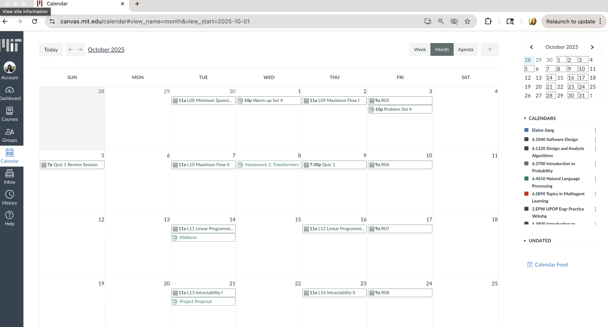

# Problem Statement
> In your first assignment, you brainstormed a set of problems that your project might address. You should now pick one of those problems and refine it for this assignment. Your problem statement should be less than one page in length, and should include the following deliverables:

### A problem domain

**Management of assignment deadlines and exam date across mutiple classes**

Academic life at MIT is fast-paced, involving managing multiple courses that each operate on their own systems (e.g., Canvas, standalone websites like 6.1040’s, Piazza, static PDFs/tables, etc). Deadlines are often buried in syllabi, one-off announcements, or recitation slides, and they’re rarely presented in a consistent or centralized way across or even within clases. As a result, it becomes the student’s responsibility to hunt down and manually track every assignment and exam date. This creates a constant low-level anxiety that something might have been missed. I and many of my friends start each semester by trying to manually build our own calendar systems, collecting these dates on Notion or Google Calendar, but that process itself is time-consuming and prone to error. The fragmentation of information across platforms adds unnecessary friction to staying on top of work and makes it easy for things to slip through the cracks -- something I and many others have experienced firsthand.

### A problem
**Students Waste Time Compiling Deadlines from Disparate Sources**
MIT students lack a unified source of truth for academic deadlines. Despite platforms like Canvas, instructors often underutilize or inconsistently update them. Many deadlines remain buried in syllabi, PDFs, static websites, and scattered announcements. As a result, students spend hours at the start of each semester and throughout it manually compiling deadlines—an exhausting, duplicative, and error-prone process that causes missed work, stress, and unnecessary planning overhead.

### A stakeholder list

- **Student Planner** : the student responsible for tracking and acting on deadlines and bears cognitive load, higher error risk, and last‑minute scramble when updates are missed
- **Instructors/TAs**: who posts and updates assignments across channels, and field repeated clarification requests, spend time duplicating posts, and see uneven participation when information fails to reach all students. 
- **Learning Platform Owner** Canvas/department IT/CAT-SOOP maintainers that hosts, integrates, or gates data, who faces blame for “poor UX” and support tickets

### Evidence and comparables
> a list of pieces of evidence that the problem is real, which will likely be citations of publicly available resources (but could also be observations that you have made about the extent or nature of the problem), and some comparables, being applications that address this or a related problem. Your list of evidence and comparables should have at least 5 entries, each with a title, an optional link, and a sentence or two explaining it.

### 1. Problem: **Deadline Information is Fragmented Across Platforms**

1. **[MIT Students Rants over inconvience of centralized calendar for assignments on MIT Confessions](https://www.facebook.com/share/p/1Attashr4Q/)**  
  This MIT Confession expresses frustration over the lack of a centralized calendar for assignments and exams, echoing a widespread desire for streamlined, unified deadline tracking, supporting the need for tools that automatically consolidate academic dates across platforms.

2. **The disarray of schedules of the classes I'm taking this semester -- aka my personal grievances**  
    *Screenshots and links show inconsistent assignment visibility across PDFs, websites, and Canvas, underscoring the fractured landscape.*
    - ***6.1040:*** Uses their own website (https://61040-fa25.github.io/). Doesn't post any assignments/info on Canvas besides announcements.
        -  
    - ***6.1220***: All deadlines and dates on the 'syllabi'/'course-information.pdf' as a table on Canvas. Only posts the next most upcoming assignment and current assignment on Canvas.
        -  but where are the times? oh look they're up here:
        -  
            - dang it, that means I can't submit at 11:59pm. But what if I had not known this/forgot about this maybe for the first assignment. Oh no!
    - ***6.3700***:  6.1220 x2 basically, but you have to look at two different pdfs for the date and the time instead of just one.
        -  
        -  
    - ***6.4610***: Oh look a class that actually posts all their assignments and exams (current and upcoming) on Canvas (not just on the syllabi, but in a way we can see it on Canvas's calender)! Yipee! 
        - 
        - 
            - ***Also, what is this catastrophe of seeing all future Recitation and lectures but not assignments for 6.1220?? This too overwhelming, hence why I don't even use Canva's Calender feature***

3. **[Reddit Example: Missed Final Due to Comment Submission](https://www.reddit.com/r/Professors/comments/1kozll5/wwyd_student_submitted_final_via_comments_on/)**  
   A student missed a major assignment due to confusion over submission channels, highlighting communication breakdown.

   

4. **[Google Classroom](https://edu.google.com/intl/ALL_us/workspace-for-education/products/classroom/)**  
   Google Classroom automatically compiles assignments, announcements, and due dates in a unified stream and calendar view, helping students stay organized and reducing missed work. Its adoption in K–12 and some university settings demonstrates how centralizing academic information can improve student awareness and accountability. The strong demand for similar functionality in systems like Canvas or Piazza highlights the need for deadline consolidation tools in more complex academic environments like MIT.

5. **[MIT Student mentions how use their Notion as a Master Calendar for all their academic dates](https://mitadmissions.org/blogs/entry/look-at-my-notion-%F0%9F%8C%B1/)**
   This DIY behavior underscores that the need is real but the burden is placed on students to patch together incomplete systems rather than rely on institutional infrastructure.

6. **[Canvas ICal](https://www.reddit.com/r/cuboulder/comments/j1i7oq/how_to_sync_canvas_calendar_to_your_ios_or/)**
   While Canvas technically offers an iCal feed, instructors often don’t enter deadlines properly or use Canvas inconsistently. This results in calendar feeds that are incomplete or unreliable, defeating the purpose of having a centralized calendar. Students are forced to cross-check against announcements, syllabi, and emails.

7. **[CAT-SOOP](https://catsoop.org/), [6.1040 Course Website](https://61040-fa25.github.io/)**
   Even though Canvas exists, many MIT courses continue to use standalone websites like using CAT-SOOP or their own github-based websites to publish schedules and deadlines. These formats are not machine-readable or easily synced to calendars, making it difficult for students to track updates unless they manually check multiple locations.

8. **[Piazza Notifications](https://support.piazza.com/support/solutions/articles/48000574383-student-email-notification-settings)**
    While Piazza has notifications for summaries of new posts, MIT students receive many emails in their inboxes so important announcements can get lost and not ever read. Also, sometimes, students disable notification if a Piazza forum is very active and prone to sending them many notifications.

9. **[Notion Templates for Students](https://www.notion.com/templates/category/school?srsltid=AfmBOooH8SN8DOJTtuzQjuVbJEbuTgsUkGBMATHN5gwKmL5QKwAGV_MP)**
    Many students use Notion to manually build class dashboards or academic planners, complete with custom calendars, to-do lists, and assignment trackers. While flexible and powerful, this requires significant setup, maintenance, and manual data entry, shifting the responsibility of organization entirely to the student rather than the institution or course platform

10. **[MIT Student-built Tools like Firehose and CourseRoad try to Solve Semester/Registration Schedulability but not mid-semester scheduling](https://firehose.guide/)**
    MIT students have built tools like Firehose and CourseRoad to help pick classes and visualize prerequisites, but there’s still no centralized, trusted platform to track actual assignments or exams across classes when in the class.

